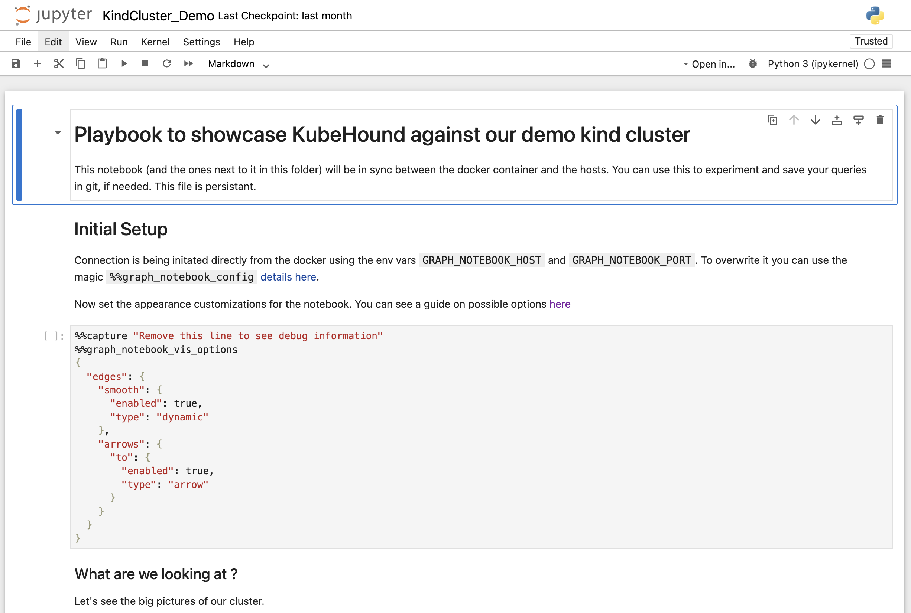
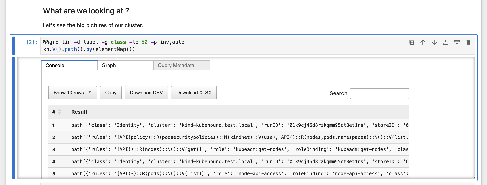
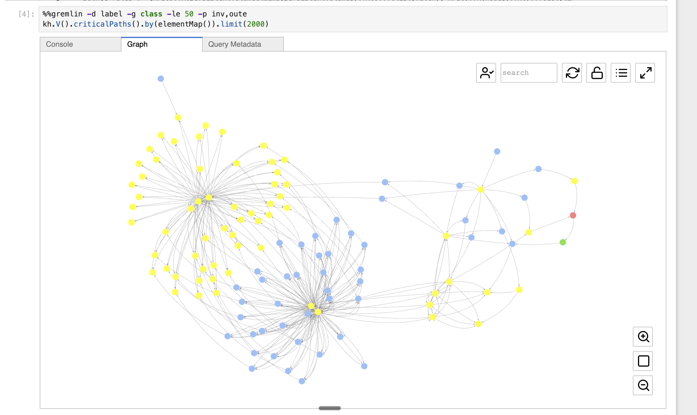

# KubeHound Test Environment

A local Kubernetes environment for learning and exploring [KubeHound](https://github.com/DataDog/KubeHound), a tool that identifies attack paths in Kubernetes clusters by building a graph of relationships between resources.

This repository provides automation to deploy KubeHound's official test cluster (24 purpose-built attack scenarios) and explore discovered attack paths through an interactive Jupyter notebook interface.

## What You'll Get

- **3-node Kind cluster** with 24 attack scenarios designed to demonstrate various Kubernetes security issues
- **KubeHound backend** (MongoDB, JanusGraph graph database, Jupyter UI)
- **Interactive notebooks** for exploring attack paths visually
- **One-command setup** that handles cluster creation, data collection, and attack graph generation

## Prerequisites

Install these tools before running the setup:

```bash
# Docker Desktop (must be running)
# https://www.docker.com/products/docker-desktop

# Kind (Kubernetes in Docker)
brew install kind

# kubectl
brew install kubectl

# KubeHound CLI
# https://github.com/DataDog/KubeHound#installation
```

Verify Docker is running:
```bash
docker ps
```

## Quick Start

### Setup

Run the setup script to create everything:

```bash
./setup-kubehound-test-cluster.sh
```

**What this does:**
1. Clones KubeHound repository to `/tmp/kubehound-repo`
2. Creates a 3-node Kind cluster named `kubehound.test.local`
3. Deploys 24 vulnerable resource manifests (pods, roles, service accounts, etc.)
4. Waits for all 43 pods to reach Running state
5. Starts KubeHound backend (MongoDB, JanusGraph, Jupyter UI)
6. **Dumps cluster data** - Collects information about all cluster resources
7. **Builds attack graph** - Analyzes relationships and identifies attack paths

Setup takes about 2-3 minutes. When complete, you'll see:

```
✅ KubeHound Test Cluster Ready!

🌐 KubeHound UI: http://localhost:8888
   Password: admin
```

### Cleanup

Remove everything:

```bash
./teardown-kubehound-test-cluster.sh
```

This deletes the cluster, backend containers, kubeconfig file, dump data, and cloned KubeHound repository.

## Understanding KubeHound Commands

The setup script automatically runs two key KubeHound CLI commands:

### `kubehound dump`

**What it does:** Collects data from the Kubernetes cluster (pods, roles, role bindings, service accounts, volumes, endpoints, etc.) and saves it locally.

**Command used:**
```bash
kubehound dump local ./dump-test -y
```

**Output:** Creates `dump-test/kind-kubehound.test.local/` directory with compressed cluster data.

**When to run manually:** If you modify the cluster (deploy new workloads, change RBAC) and want to re-analyze it, run this command with the kubeconfig:
```bash
export KUBECONFIG=./kubehound-test.kubeconfig
kubehound dump local ./dump-test -y
```

### `kubehound ingest`

**What it does:** Processes the dumped data, analyzes relationships between resources, and builds an attack graph stored in the JanusGraph database. This is where KubeHound identifies attack paths like "Container with privileged permissions can escape to node, node can access secrets, secrets lead to cluster-admin."

**Command used:**
```bash
kubehound ingest local dump-test/kind-kubehound.test.local --skip-backend
```

**Output:** Ingests identities, permission sets, pods, containers, volumes, endpoints, and creates edges representing attack steps (VOLUME_ACCESS, ROLE_BIND, CE_PRIV_MOUNT, TOKEN_STEAL, etc.).

**When to run manually:** After running `dump` with modified cluster data:
```bash
kubehound ingest local dump-test/kind-kubehound.test.local --skip-backend
```

## Exploring Attack Paths with Jupyter Notebook

### What is Jupyter Notebook?

Jupyter Notebook is a web-based interactive environment where you can write and execute code in "cells." Each cell contains either:
- **Code** (queries that fetch and visualize attack paths)
- **Markdown** (explanatory text)

Think of it like a runnable document that combines explanations with live query results.

### Accessing the UI

Open your browser to: **http://localhost:8888**

**Password:** `admin`

You'll see the Jupyter file browser showing directories.

### Opening the Demo Notebook

1. Navigate to the `kubehound_presets/` folder
2. Click on **`KindCluster_Demo.ipynb`**

This opens the main demo notebook designed specifically for Kind clusters.


*The KindCluster_Demo notebook showing the title, introduction, and initial setup section*

### Understanding the Notebook Interface

**Cell numbering:**
- `[1]`, `[2]`, `[3]` - Cell has been executed (number shows execution order)
- `[*]` - Cell is currently running (or hasn't been executed yet)
- `[ ]` - Cell hasn't been executed

**Running cells:**
- Click a cell to select it
- Press **Shift + Enter** to execute the cell
- Results appear below the cell

**Important:** Run cells sequentially from top to bottom. Some cells depend on previous ones.

### Result Tabs

After executing a query cell, you'll see tabs above the results:

- **Console** - Shows data in table format (good for seeing raw details)
- **Graph** - Shows visual network diagram of attack paths (nodes and edges)
- **Query Metadata** - Shows query execution details

Click between tabs to view results differently.


*Console tab shows tabular data, while the Graph tab (shown with many scattered nodes) visualizes relationships*

### The KindCluster_Demo Notebook Structure

The notebook walks you through attack path discovery with a progressive narrative:

**1. Initial Setup**
Configures graph visualization settings (smooth edges, arrows, etc.).

**2. "What are we looking at?"**
Starts with the big picture - queries all vertices (resources) and their critical paths.

**Query example:**
```gremlin
kh.V().criticalPaths().by(elementMap()).limit(2000)
```

**Result:** Overwhelming! Shows hundreds of attack paths. Too much to make sense of.

**3. "Let's look at the containers then"**
Narrows focus to just container-based attack paths.

**Query example:**
```gremlin
kh.containers().criticalPaths().by(elementMap())
```

**Result:** Still too much. Demonstrates the need for further filtering.

**4. "Let's look at the basic, the endpoints"**
Focuses on endpoints (exposed services) since they're the most realistic entry points for attackers.

**Query example:**
```gremlin
kh.endpoints().criticalPaths().by(elementMap())
```

**Result:** More manageable! Shows which exposed services can lead to critical access.

**5. "Let's get the vulnerability context"**
Groups endpoints by service to understand which services are vulnerable.

**Query example:**
```gremlin
kh.endpoints().criticalPaths().limit(local,1)
  .dedup().valueMap("serviceEndpoint","port")
  .group().by("serviceEndpoint").by("port")
```

**Result:** Table showing service endpoints and their exposed ports.

**6. "Let's look at the specific services that interest us"**
Filters out noise (like `kube-dns`) to focus on actual vulnerable services.

**Query example:**
```gremlin
kh.endpoints().not(has("serviceEndpoint","kube-dns")).criticalPaths().by(elementMap())
```

**Result:** Clean list of attack paths from interesting services.

**7. "Initial exposure identified"**
Shows multi-hop attack chains: starts from an endpoint, follows the attack path, stops when it reaches a Node.

**Query example:**
```gremlin
kh.endpoints().not(has("serviceEndpoint","kube-dns"))
  .repeat(
    outE().inV().simplePath()
  )
  .until(
    hasLabel("Node")
    .or()
    .loops().is(5)
  )
  .hasLabel("Node")
  .path()
  .by(elementMap())
  .limit(100)
```

**Result:** Multi-step attack paths showing: Endpoint → Container → Pod → Node

This is the "true findings" section showing realistic attack scenarios.

### Understanding Attack Path Graphs

When viewing results in the **Graph** tab, you'll see:

- **Nodes (circles)** - Kubernetes resources (pods, containers, identities, roles, nodes)
- **Edges (arrows)** - Attack steps connecting resources
- **Edge labels** - Attack type (e.g., VOLUME_ACCESS, ROLE_BIND, CE_PRIV_MOUNT)


*An unfiltered attack path graph showing ALL relationships - this is overwhelming! The notebook explains "this is bad" and demonstrates why filtering is necessary. Different colored nodes represent different resource types.*

**Common attack types:**
- **VOLUME_ACCESS** - Container can access a volume containing sensitive data
- **ROLE_BIND** - Identity can bind a privileged role to itself
- **CE_PRIV_MOUNT** - Container can escape to host via privileged mount
- **TOKEN_STEAL** - Container can steal service account tokens
- **IDENTITY_ASSUME** - Identity can assume another identity's permissions

**Reading a path:** Follow arrows from left to right to see the attack progression. Example: "Endpoint exposes Pod → Pod has privileged container → Container can CE_PRIV_MOUNT → Gains Node access."

### Experimenting with Queries

You can modify queries or add new cells:

1. **To add a new cell:** Click the `+` button in the toolbar
2. **To modify a query:** Click into the cell, edit the code, press Shift+Enter
3. **To restart:** Kernel → Restart & Clear Output

**Tip:** Start with the existing queries and make small changes to learn the syntax.

## Kubeconfig Isolation

The setup script creates a **local kubeconfig file** (`./kubehound-test.kubeconfig`) instead of modifying your global `~/.kube/config`. This keeps the test cluster isolated from your other Kubernetes contexts.

**To interact with the cluster manually:**
```bash
export KUBECONFIG=./kubehound-test.kubeconfig
kubectl get pods --all-namespaces
```

Or use the `--kubeconfig` flag:
```bash
kubectl --kubeconfig=./kubehound-test.kubeconfig get nodes
```

## Troubleshooting

### Docker Issues

**Symptom:** `kind get clusters` hangs or setup script stalls

**Solution:** Restart Docker Desktop or reboot your machine. Docker can get into a stuck state.

### Backend Not Starting

**Symptom:** Setup fails with "Backend not healthy"

**Solution:**
```bash
# Stop any existing backend
kubehound backend down

# Remove old containers
docker rm -f $(docker ps -a -q --filter name=kubehound-release)

# Re-run setup
./setup-kubehound-test-cluster.sh
```

### Cells Not Executing in Jupyter

**Symptom:** Cell shows `[*]` and never completes

**Possible causes:**
1. **Previous cell still running** - Wait for it to finish
2. **Docker/Backend stuck** - Check `docker ps` to verify containers are running
3. **Kernel dead** - Restart the kernel (Kernel → Restart in Jupyter menu)

**Solution:** Try running cells sequentially from the top. If stuck, restart the kernel.

### Port Already in Use

**Symptom:** "Port 8888 already in use"

**Solution:**
```bash
# Find process using port 8888
lsof -ti:8888 | xargs kill -9

# Or change the backend port (not recommended for beginners)
```

### Cluster Already Exists

**Symptom:** Setup fails with "Cluster 'kubehound.test.local' already exists"

**Solution:** Run teardown first:
```bash
./teardown-kubehound-test-cluster.sh
./setup-kubehound-test-cluster.sh
```

### Graph Tab Empty

**Symptom:** Console tab shows data but Graph tab is blank

**Possible causes:**
1. Query returns table data (not graph data)
2. Too many results to render (increase limit)
3. Browser rendering issue

**Solution:** Try clicking the Console tab to see if data exists. Some queries return tables, not graphs. Graphs appear when queries return paths (nodes + edges).

## What's Next?

- **Explore other notebooks** in `kubehound_presets/` like `RedTeam.ipynb`, `BlueTeam.ipynb`
- **Modify the cluster** - Deploy your own workloads, then re-run `dump` and `ingest`
- **Learn Gremlin** - The query language used by KubeHound (graph traversal)
- **Try Kubernetes Goat** - See [PRD #3](prds/3-kubernetes-goat-integration.md) for future integration

## Architecture Overview

**Components:**
- **Kind cluster** (`kubehound.test.local`) - 3 nodes running Kubernetes v1.33.1
- **Attack scenarios** - 24 YAML manifests deploying vulnerable configurations
- **MongoDB** - Stores normalized cluster data
- **JanusGraph** - Graph database storing attack paths
- **Jupyter UI** - Web interface for exploring the graph at http://localhost:8888

**Data flow:**
```
Kubernetes Cluster
    ↓ (kubehound dump)
Compressed cluster data
    ↓ (kubehound ingest)
MongoDB + JanusGraph
    ↓ (Jupyter queries)
Visual attack path graphs
```

## Resources

- **KubeHound Documentation** - https://github.com/DataDog/KubeHound
- **Gremlin Query Language** - https://tinkerpop.apache.org/gremlin.html
- **Jupyter Notebook Basics** - https://jupyter.org/
- **Kind Documentation** - https://kind.sigs.k8s.io/

## Repository Structure

```
KubeHound-Demo/
├── setup-kubehound-test-cluster.sh   # One-command setup
├── teardown-kubehound-test-cluster.sh # Complete cleanup
├── kubehound-test.kubeconfig          # Isolated cluster config (created by setup)
├── dump-test/                         # Cluster data (created by setup)
├── prds/                              # Product requirement documents
│   ├── 2-automated-demo-environment.md
│   └── 3-kubernetes-goat-integration.md (future work)
└── README.md                          # This file
```

## Contributing

This is a personal learning repository. Feel free to fork and experiment!

## License

This repository's automation scripts are provided as-is for educational purposes. KubeHound itself is licensed under Apache 2.0.
