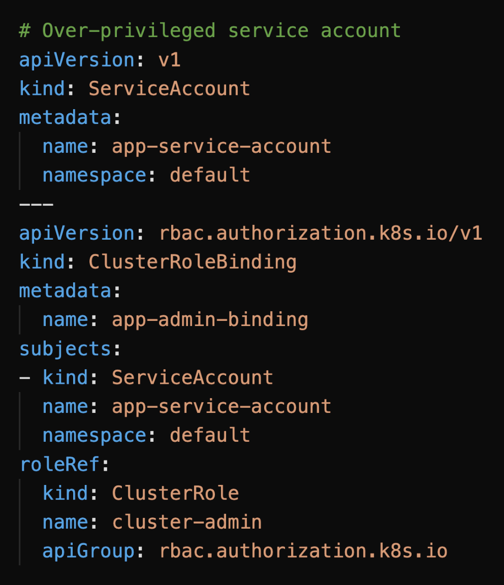
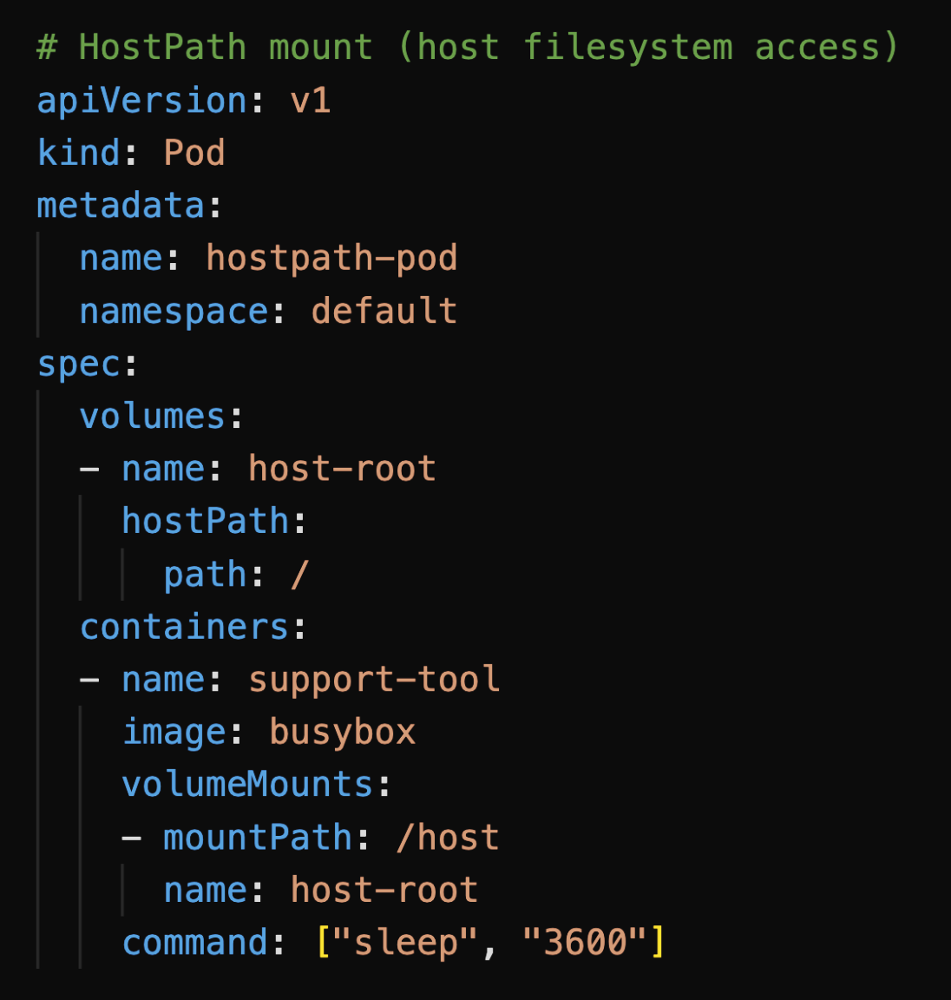
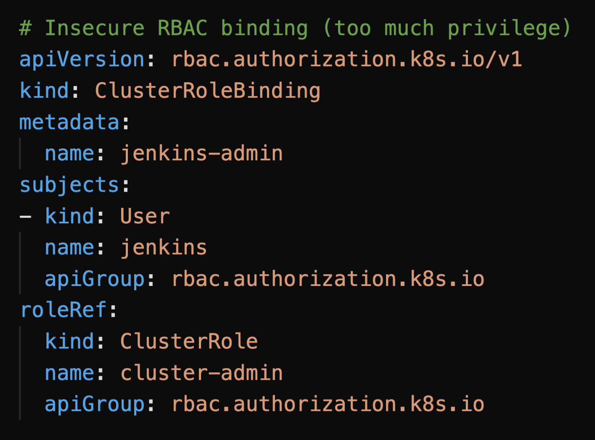
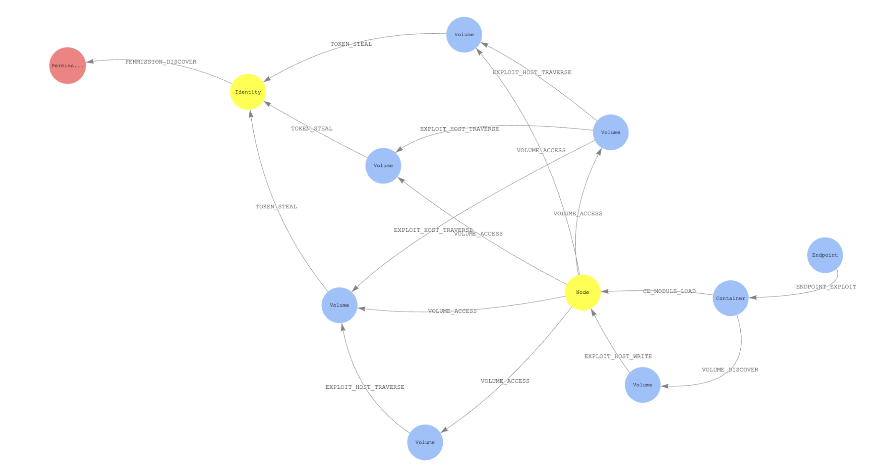
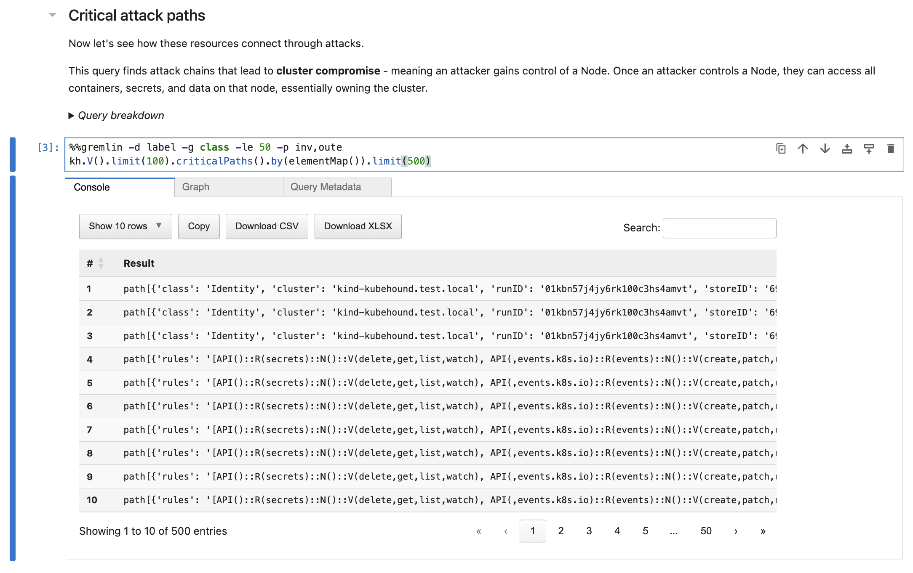
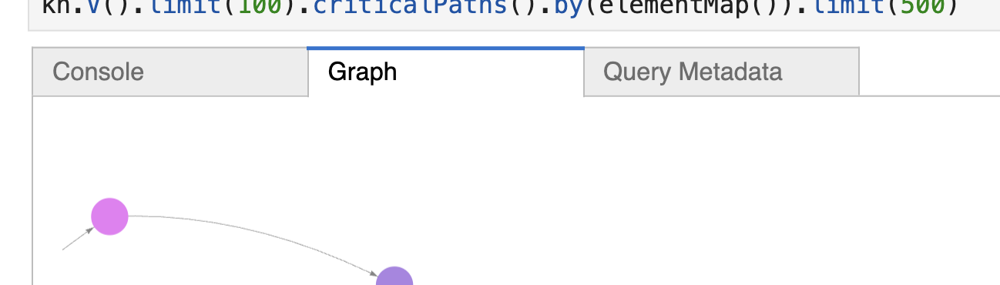
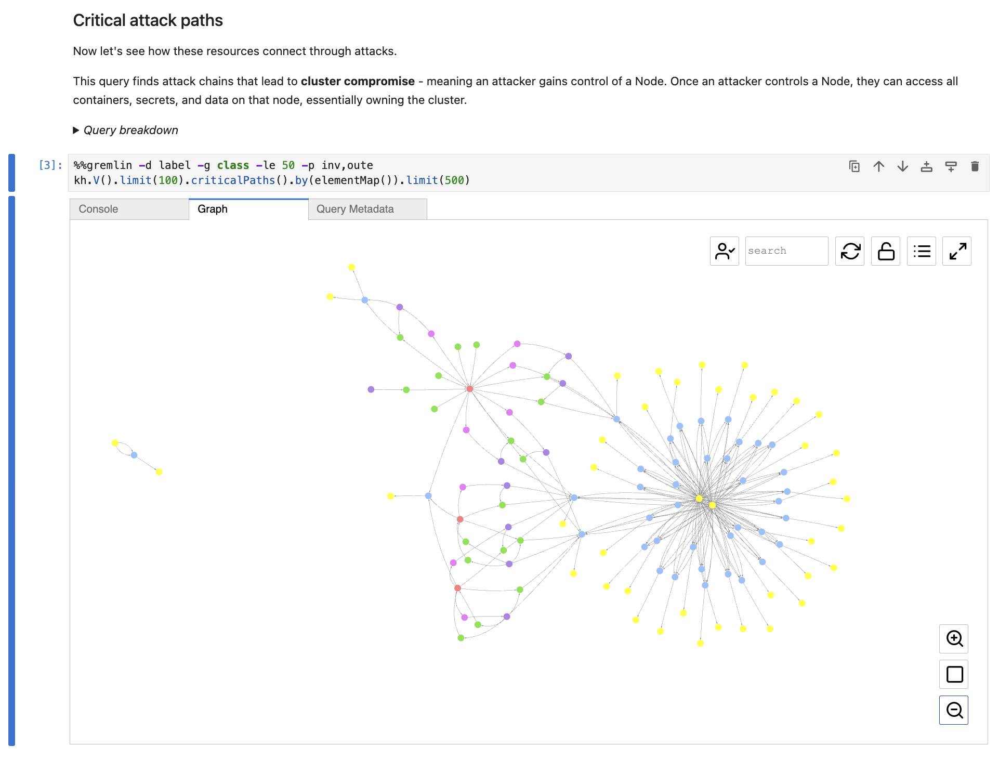
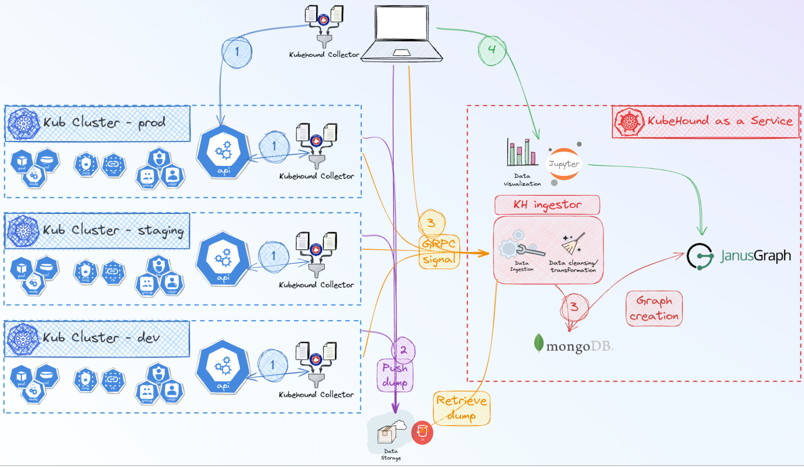

# KubeHound Test Environment

A local Kubernetes environment for learning and exploring [KubeHound](https://kubehound.io/), a tool that identifies attack paths in Kubernetes clusters by building a graph of relationships between resources.

This repository provides automation to deploy KubeHound's official test cluster (1 attack scenario: ENDPOINT_EXPLOIT) and explore discovered attack paths through an interactive Jupyter notebook interface.

> **Just want to run the demo?** [Skip to Getting Started](#getting-started)

## Why Attack Paths Matter

Kubernetes misconfigurations are common—and often introduced with the best intentions. A developer hits a permissions error during deployment and grants `cluster-admin` "just to make it work." A CI/CD job fails, so someone adds broad RBAC access to get it running. A support engineer needs quick access to logs and mounts the host filesystem.

### Example: Over-privileged Service Account



*A service account granted cluster-admin privileges—often done to bypass permission errors during development.*

### Example: HostPath Mount



*A pod mounting the host's root filesystem—breaks container isolation entirely.*

### Example: Insecure RBAC Binding



*A ClusterRoleBinding giving broad permissions to automation—often created when CI/CD pipelines fail with access errors.*

### The Problem with Lists

Security scanners can find these issues. But they give you a list:

| Finding | Count |
|---------|-------|
| Container escapes | 14 |
| Privilege escalations (RBAC) | 32 |
| Escape to host (volume configs) | 34 |
| Lateral movement between containers | 72 |

Here's the critical question: **Is this cluster actually secure?**

You can't tell from a list. Which of these 152 findings actually matter? Can an attacker chain them together to reach critical assets? What should you fix first?

### Graphs, Not Lists

KubeHound answers these questions by modeling your cluster as a graph:



*Source: [kubehound.io](https://kubehound.io/)*

Instead of listing problems, KubeHound shows how they connect—revealing actual attack paths from entry points to cluster compromise. Each node is a resource (Container, Node, Identity, Volume). Each edge is an attack technique (TOKEN_STEAL, VOLUME_ACCESS, ENDPOINT_EXPLOIT).

This lets you focus your security efforts on what truly matters: the paths attackers can actually exploit.

## What You'll Get

- **3-node Kind cluster** with 1 attack scenario (ENDPOINT_EXPLOIT) designed to demonstrate Kubernetes security issues
- **KubeHound backend** (MongoDB, JanusGraph graph database, Jupyter UI)
- **Interactive notebook** for exploring attack paths visually
- **One-command setup** that handles cluster creation, data collection, and attack graph generation

## How KubeHound Works

### Misconfigurations vs. Attacks

It's important to distinguish between **misconfigurations** and **attacks**:

- **Misconfigurations** are opportunities—a privileged container, an overly permissive role binding, a hostPath mount. They're not inherently exploited, but they create openings.
- **Attacks** are actions an attacker takes to exploit those opportunities—stealing a token, escaping a container, binding a new role.

Here are some example attacks that exploit our misconfiguration examples from earlier:

| Misconfiguration | Example Attacks |
|------------------|-----------------|
| Over-privileged Service Account | TOKEN_STEAL (steal the powerful token), IDENTITY_ASSUME (act as that identity) |
| HostPath Mount | EXPLOIT_HOST_READ/WRITE (access host files), CE_PRIV_MOUNT (escape container) |
| Insecure RBAC Binding | ROLE_BIND (grant yourself more permissions), POD_CREATE (spawn privileged pods) |

### Attack Primitives Library

KubeHound includes a library of ~27 attack primitives—small, discrete actions an attacker might take in a Kubernetes cluster. These primitives are mapped to the [MITRE ATT&CK framework](https://attack.mitre.org/), a widely-used knowledge base of adversary tactics and techniques. MITRE categories like "Privilege Escalation," "Credential Access," and "Lateral Movement" help security teams understand attacks using industry-standard terminology.

KubeHound chains these primitives together based on your cluster's actual configuration—turning individual misconfigurations into realistic, exploitable attack paths.

See the full list: [KubeHound Attack Reference](https://kubehound.io/reference/attacks/)

### Collect, Build, Query

KubeHound analyzes your cluster in three steps:

**Step 1: Collect** — KubeHound connects to the Kubernetes API and gathers entity data. This isn't just a list of resources—it's the security-relevant details: pod security contexts, volume mounts, service account bindings, RBAC permissions, network policies, and more.

**Step 2: Build Graph** — KubeHound processes the collected data and constructs an attack graph. Resources become nodes; attack primitives become edges connecting them.

**Step 3: Query & Visualize** — You explore the graph to find attack paths. KubeHound provides a DSL (domain-specific language) on top of Gremlin that makes common security questions easy to ask, like *"What's the shortest path from a public endpoint to cluster-admin?"*

### Components

KubeHound has 4 main components in this setup:

**1. KubeHound CLI (binary on your computer)**
- The `kubehound` command you install
- Connects to Kubernetes clusters to collect configuration data
- Processes and stores data in the backend
- Commands: `kubehound dump` (collect data), `kubehound ingest` (build graph)

**2. MongoDB container (data storage)**
- Stores raw Kubernetes resource data
- Contains pods, roles, bindings, service accounts, volumes, etc.

**3. JanusGraph container (graph database)**
- Reads data from MongoDB
- Builds the attack graph with vertices (resources) and edges (attack techniques)
- Processes Gremlin queries to find attack paths

**4. Jupyter container (web UI)**
- Interactive notebook interface at http://localhost:8888
- Runs queries against JanusGraph
- Visualizes attack paths as graphs and tables

**Data Flow:**
```
KubeHound CLI → Collects from Kind cluster → Stores in MongoDB
                      ↓
KubeHound CLI → Tells JanusGraph to ingest → Builds attack graph
                      ↓
You → Use Jupyter UI → Queries JanusGraph → See attack paths
```

## Getting Started

First, clone this repository:

```bash
git clone https://github.com/wiggitywhitney/KubeHound-Demo.git
cd KubeHound-Demo
```

Then proceed to install the prerequisites below.

## Prerequisites

Install these tools before running the setup script:

| Tool | Purpose | Installation |
|------|---------|--------------|
| **Docker** | Container runtime | [Install Docker](https://docs.docker.com/get-docker/) |
| **Kind** | Local Kubernetes clusters | [Install Kind](https://kind.sigs.k8s.io/docs/user/quick-start/#installation) |
| **kubectl** | Kubernetes CLI | [Install kubectl](https://kubernetes.io/docs/tasks/tools/) |
| **KubeHound CLI** | Attack path analysis | [Install KubeHound](https://kubehound.io/user-guide/getting-started/) |

### Windows Users: Bash Environment Required

This demo uses bash scripts. Windows Command Prompt and PowerShell are not compatible. Choose one of these bash environments:

**Option A: WSL2 (Recommended)**
- Full Linux environment with native Docker Desktop integration
- Best compatibility with Kubernetes tooling
- Install: [WSL2 Setup Guide](https://learn.microsoft.com/en-us/windows/wsl/install)
- After installing WSL2, install Docker Desktop and enable WSL2 integration in Docker Desktop settings

**Option B: Git Bash**
- Lightweight bash environment included with [Git for Windows](https://git-scm.com/download/win)
- Works for running these scripts
- May require additional Docker configuration

**Important**: Install the prerequisites (Docker, Kind, kubectl, KubeHound) inside your chosen bash environment.

## Quick Start

### Setup

Run the setup script to create everything:

```bash
./setup-kubehound-test-cluster.sh
```

**What this does:**
1. Creates a 3-node Kind cluster named `kubehound.test.local`
2. Deploys 1 vulnerable resource manifest (ENDPOINT_EXPLOIT: privileged pod with exposed service)
3. Waits for all pods to reach Running state
4. Starts KubeHound backend (MongoDB, JanusGraph, Jupyter UI)
5. **Dumps cluster data** - Collects information about all cluster resources
6. **Builds attack graph** - Analyzes relationships and identifies attack paths

Setup takes about 2-3 minutes. When complete, you'll see:

```
✅ KubeHound Test Cluster Ready!

🌐 KubeHound UI: http://localhost:8888
   Password: admin
```

### What do you want to do next?

- **[Explore the notebook](#exploring-attack-paths-with-jupyter-notebook)** — Jump straight into querying attack paths in the Jupyter UI
- **[Understand the setup](#understanding-kubehound-commands)** — Learn what the setup script did and how KubeHound commands work

## Understanding KubeHound Commands

The setup script automatically runs two key KubeHound CLI commands:

### `kubehound dump`

**What it does:** Collects data from the Kubernetes cluster (pods, roles, role bindings, service accounts, volumes, endpoints, etc.) and saves it locally.

**Command used:**
```bash
kubehound dump local ./dump-test -y
```

**Output:** Creates `dump-test/kind-kubehound.test.local/` directory with compressed cluster data.

**When to run manually:** If you modify the cluster (deploy new workloads, change RBAC) and want to re-analyze it, run this command with the kubeconfig:
```bash
export KUBECONFIG=./kubehound-test.kubeconfig
kubehound dump local ./dump-test -y
```

### `kubehound ingest`

**What it does:** Processes the dumped data, analyzes relationships between resources, and builds an attack graph stored in the JanusGraph database. This is where KubeHound identifies attack paths like "Container with privileged permissions can escape to node, node can access secrets, secrets lead to cluster-admin."

**Command used:**
```bash
kubehound ingest local dump-test/kind-kubehound.test.local --skip-backend
```

**Output:** Ingests identities, permission sets, pods, containers, volumes, endpoints, and creates edges representing attack steps (VOLUME_ACCESS, ROLE_BIND, CE_PRIV_MOUNT, TOKEN_STEAL, etc.).

**When to run manually:** After running `dump` with modified cluster data:
```bash
kubehound ingest local dump-test/kind-kubehound.test.local --skip-backend
```

## Exploring Attack Paths with Jupyter Notebook

### What is Jupyter Notebook?

Jupyter Notebook is a web-based interactive environment where you can write and execute code in "cells." Each cell contains either:
- **Code** (queries that fetch and visualize attack paths)
- **Markdown** (explanatory text)

Think of it like a runnable document that combines explanations with live query results.

### Accessing the UI

Open your browser to: **http://localhost:8888**

**Password:** `admin`

You'll see the Jupyter file browser showing directories.

### Opening the Demo Notebook

1. Navigate to the `kubehound_presets/` folder
2. Click on **`KindCluster_Demo.ipynb`**

This is the demo notebook designed specifically for Kind clusters.

### Understanding the Notebook Interface

**Cell numbering:**
- `[1]`, `[2]`, `[3]` - Cell has been executed (number shows execution order)
- `[*]` - Cell is currently running (or hasn't been executed yet)
- `[ ]` - Cell hasn't been executed

**Running cells:**
- Click a cell to select it
- Press **Shift + Enter** to execute the cell
- Results appear below the cell

**Important:** Run cells sequentially from top to bottom. Some cells depend on previous ones.



*A code cell showing the query, execution indicator `[3]`, and results in the Console tab.*

### Result Tabs

After executing a query cell, you'll see tabs above the results:

- **Console** - Shows data in table format (good for seeing raw details)
- **Graph** - Shows visual network diagram of attack paths (nodes and edges)
- **Query Metadata** - Shows query execution details

Click between tabs to view results differently.



*Click the **Graph** tab to see visual attack paths instead of raw data.*



*The Graph tab shows attack paths as connected nodes - this is where the visual insights are!*

### The KindCluster_Demo Notebook Structure

The notebook walks you through attack path discovery with a progressive filtering approach, demonstrating how to narrow down from hundreds of attack paths to the most critical, actionable findings:

**1. Initial Setup**
Configures graph visualization settings (smooth edges, arrows).

**2. What are we looking at?**
Shows all Kubernetes resources as individual dots, with each color representing a different resource type (pods, containers, identities, nodes, volumes).

**3. Critical attack paths**
Finds attack chains that lead to cluster compromise - when an attacker gains control of a Node and can access all containers, secrets, and data.

**Result:** 388 attack paths found - overwhelming!

**4. Too much information!**
Narrows down to containers since they often have misconfigurations like excessive permissions, container escape vulnerabilities, and access to sensitive volumes.

**Result:** Still too many results.

**5. Still too many results**
Focuses on endpoints (exposed services) - the realistic entry points for external attackers. Supply chain attacks exist but are sophisticated and less common.

**Result:** More manageable - shows attack paths from externally accessible services.

**6. Identify the vulnerable services**
Steps back from complex graphs to get a simple list of which services (by name and port) have critical attack paths.

**Result:** Table showing vulnerable service endpoints and ports.

**7. Filter out internal infrastructure**
Removes internal services like `kube-dns` (Kubernetes' internal DNS service) to focus on externally-accessible services attackers would actually target.

**Result:** Clean attack paths from interesting services only.

**8. Trace the complete attack path**
Shows the complete step-by-step attack chain: which endpoint an attacker starts from, what they compromise along the way (containers, identities, permissions), and how they reach Node access.

**Query example:**
```gremlin
kh.endpoints().not(has("serviceEndpoint","kube-dns"))
  .repeat(outE().inV().simplePath())
  .until(hasLabel("Node").or().loops().is(5))
  .hasLabel("Node")
  .path().by(elementMap())
  .limit(100)
```

**Result:** Complete attack chains from external entry points to cluster compromise.

**9. Congratulations!**
You've successfully filtered down from hundreds of attack paths to the most critical, actionable findings.

### Understanding Attack Path Graphs

When viewing results in the **Graph** tab, you'll see:

- **Nodes (circles)** - Kubernetes resources (pods, containers, identities, roles, nodes)
- **Edges (arrows)** - Attack steps connecting resources
- **Edge labels** - Attack type (e.g., VOLUME_ACCESS, ROLE_BIND, CE_PRIV_MOUNT)

**Common attack types:** (see [full attack library](https://kubehound.io/reference/attacks/))
- **VOLUME_ACCESS** - Container can access a volume containing sensitive data
- **ROLE_BIND** - Identity can bind a privileged role to itself
- **CE_PRIV_MOUNT** - Container can escape to host via privileged mount
- **TOKEN_STEAL** - Container can steal service account tokens
- **IDENTITY_ASSUME** - Identity can assume another identity's permissions

**Reading a path:** Follow arrows from left to right to see the attack progression. Example: "Endpoint exposes Pod → Pod has privileged container → Container can CE_PRIV_MOUNT → Gains Node access."

### Query Language: Gremlin and KubeHound DSL

The queries in the notebook use **Gremlin**, a graph traversal language designed for querying graph databases. KubeHound provides a custom DSL (Domain-Specific Language) wrapper on top of Gremlin to make security analysis easier.

**KubeHound DSL shortcuts:**
- `kh.V()` - Get all vertices (all resources in the cluster)
- `kh.containers()` - Get all container vertices
- `kh.endpoints()` - Get all endpoint vertices (exposed services)
- `.criticalPaths()` - Find paths that lead to critical access (nodes, cluster-admin, etc.)

**Gremlin traversal methods:**
- `.has("property", "value")` - Filter vertices by property
- `.not(...)` - Exclude matching vertices
- `.outE().inV()` - Follow outgoing edges to connected vertices
- `.repeat(...).until(...)` - Traverse paths until a condition is met
- `.path()` - Return the full path taken through the graph
- `.limit(n)` - Limit results to n items

**Example breakdown:**
```gremlin
kh.endpoints()                           // Start with all endpoints
  .not(has("serviceEndpoint","kube-dns")) // Exclude kube-dns
  .criticalPaths()                        // Find paths to critical access
  .by(elementMap())                       // Include all properties
```

This query finds attack paths starting from exposed services (excluding system services) that lead to cluster compromise.

### Experimenting with Queries

You can modify queries or add new cells:

1. **To add a new cell:** Click the `+` button in the toolbar
2. **To modify a query:** Click into the cell, edit the code, press Shift+Enter
3. **To restart:** Kernel → Restart & Clear Output

**Tip:** Start with the existing queries and make small changes to learn the syntax. The [Gremlin documentation](https://tinkerpop.apache.org/gremlin.html) and [KubeHound query examples](https://github.com/DataDog/KubeHound/tree/main/docs) are helpful references.

## Kubeconfig Isolation

The setup script creates a **local kubeconfig file** (`./kubehound-test.kubeconfig`) instead of modifying your global `~/.kube/config`. This keeps the test cluster isolated from your other Kubernetes contexts.

**To interact with the cluster manually:**
```bash
export KUBECONFIG=./kubehound-test.kubeconfig
kubectl get pods --all-namespaces
```

Or use the `--kubeconfig` flag:
```bash
kubectl --kubeconfig=./kubehound-test.kubeconfig get nodes
```

## Architecture Overview

**Components:**
- **Kind cluster** (`kubehound.test.local`) - 3-node Kubernetes cluster
- **Attack scenarios** - 1 YAML manifest (ENDPOINT_EXPLOIT) deploying vulnerable configuration
- **MongoDB** - Stores normalized cluster data
- **JanusGraph** - Graph database storing attack paths
- **Jupyter UI** - Web interface for exploring the graph at http://localhost:8888

**Data flow:**
```
Kubernetes Cluster
    ↓ (kubehound dump)
Compressed cluster data
    ↓ (kubehound ingest)
MongoDB + JanusGraph
    ↓ (Jupyter queries)
Visual attack path graphs
```

## Running at Scale

This demo runs KubeHound locally against a small Kind cluster. In production, KubeHound handles much larger environments.

### Performance

KubeHound is [designed for speed](https://kubehound.io/#:~:text=KubeHound%20was%20built%20with%20efficiency%20in%20mind%20and%20can%20consequently%20handle%20very%20large%20clusters.%20Ingestion%20and%20computation%20of%20attack%20paths%20typically%20takes%20a%20few%20seconds%20for%20a%20cluster%20with%201%27000%20running%20pods%2C%202%20minutes%20for%2010%27000%20pods%2C%20and%205%20minutes%20for%2025%27000%20pods.):
- **~1,000 pods**: A few seconds for ingestion and graph construction
- **~10,000 pods**: About 2 minutes

### KubeHound as a Service

For production clusters, KubeHound can run as a distributed service:



*Source: [KubeHound Documentation](https://kubehound.io/khaas/getting-started/)*

1. **Collectors** run on each cluster (prod, staging, dev), gathering entity data from the Kubernetes API
2. **Push dump** — Collectors push data to centralized storage (e.g., S3)
3. **gRPC signal** — Triggers the ingestor when new data arrives
4. **Graph creation** — The KH Ingestor processes data and builds the attack graph in JanusGraph
5. **Data visualization** — Jupyter UI provides a unified view across all clusters

This architecture lets you monitor attack paths across your entire Kubernetes fleet from one place.

For more details, see the [KubeHound documentation](https://kubehound.io/).

## Cleanup

When you're done exploring, remove everything:

```bash
./teardown-kubehound-test-cluster.sh
```

This deletes the cluster, backend containers, kubeconfig file, and dump data.

## Resources

- **KubeHound Official Site** - https://kubehound.io/
- **KubeHound GitHub** - https://github.com/DataDog/KubeHound
- **Gremlin Query Language** - https://tinkerpop.apache.org/gremlin.html
- **Jupyter Notebook Basics** - https://jupyter.org/
- **Kind Documentation** - https://kind.sigs.k8s.io/

## Repository Structure

```
KubeHound-Demo/
├── setup-kubehound-test-cluster.sh    # One-command setup script
├── teardown-kubehound-test-cluster.sh  # Complete cleanup script
├── docs/
│   └── images/                        # Screenshots for README
└── README.md                          # This file
```

**Generated files (gitignored):**
- `kubehound-test.kubeconfig` - Isolated cluster config
- `dump-test/` - Cluster data dump
- `*.log` - Setup/teardown logs

## Contributing

This is a personal learning repository. Feel free to fork and experiment!

## License

This repository's automation scripts are provided as-is for educational purposes. KubeHound itself is licensed under Apache 2.0.
